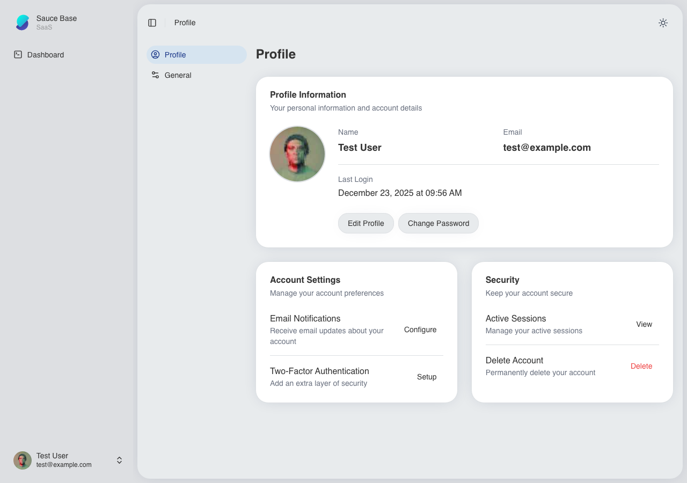
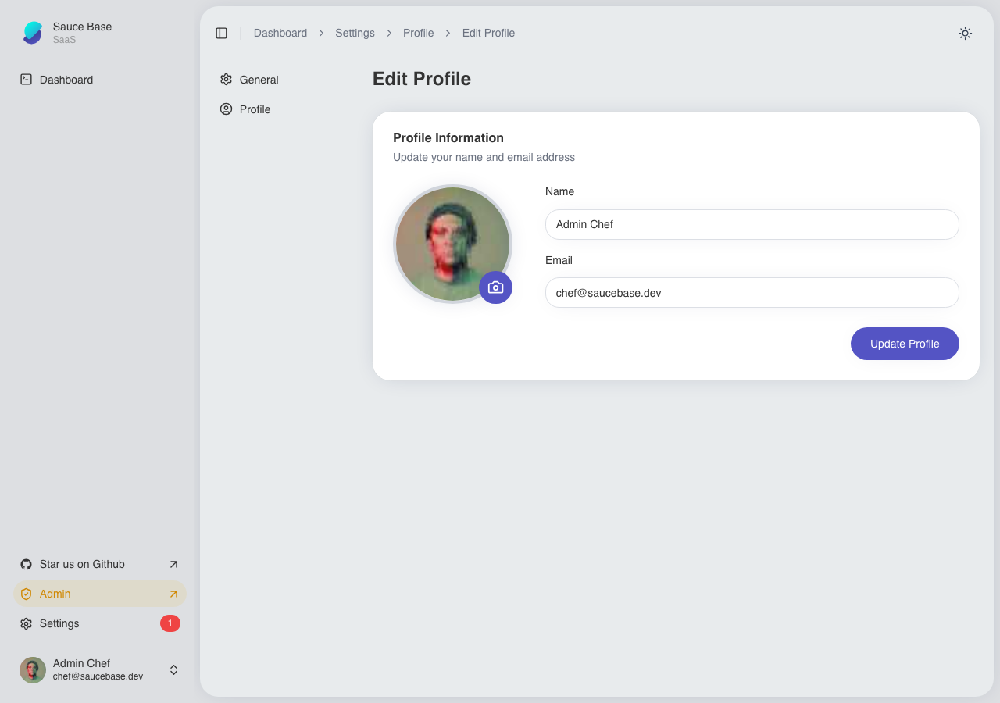
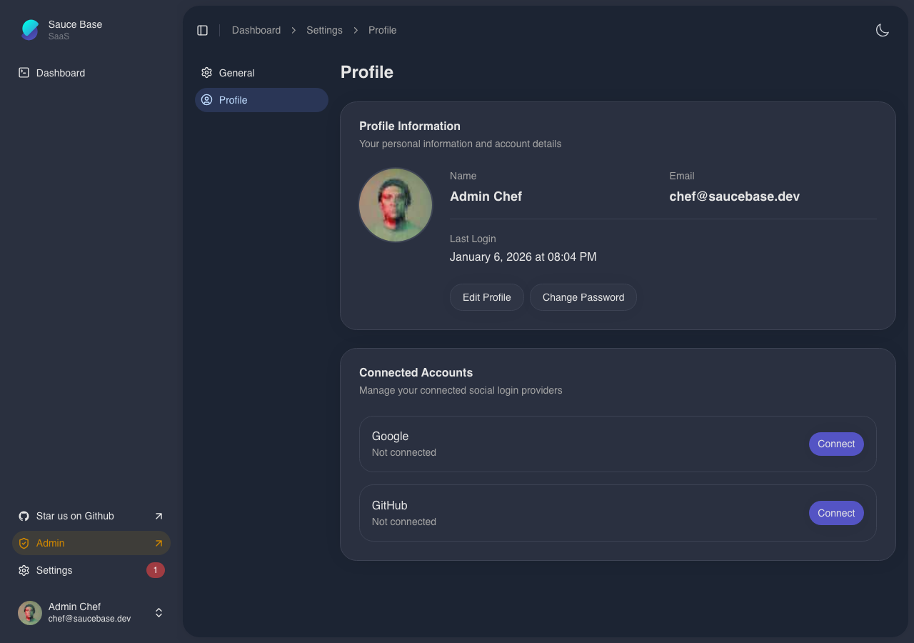
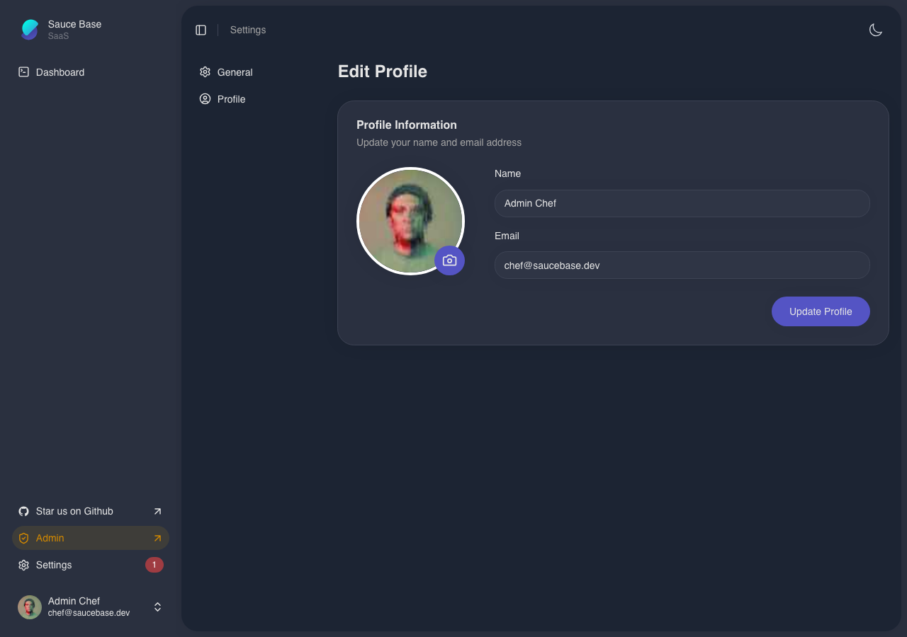

<p align="center">
  
</p>

# Saucebase

**Modular Laravel SaaS Starter Kit**

> ⚠️ **Active development** – APIs, features, and architecture may change without notice.

[](https://github.com/sauce-base/saucebase/actions/workflows/phpunit.yml)
[](https://github.com/sauce-base/saucebase/actions/workflows/e2e.yml)
[](LICENSE)
[](https://php.net)
[](https://laravel.com)
[](https://vuejs.org)
[](https://typescriptlang.org)
[](https://vitejs.dev)
[](https://tailwindcss.com)
[](https://nodejs.org)
[](https://inertiajs.com)
[](https://filamentphp.com)
[](https://playwright.dev)
[](https://phpstan.org)
[](https://commitlint.js.org)

Saucebase is a **Laravel SaaS boilerplate / Starter kit** that lets you own your code. Built on the **VILT stack** (Vue 3, Inertia.js, Laravel, Tailwind CSS), it follows the **copy-and-own philosophy** pioneered by shadcn/ui—install feature modules directly into your repository, customize freely, and never worry about upstream breaking changes.

Start with a minimal, production-ready core. Add pre-built modules (Auth, Settings) with one command. Everything lives in your repo. No hidden packages, no vendor lock-in. Just modern Laravel development with TypeScript, hot reload, Docker-first setup, and built-in best practices.

---

## 🚀 Why Saucebase?

### You Own The Code

Like shadcn/ui, modules install **directly into your repository**. No vendor packages to break. Customize, refactor, or completely rewrite any feature without forking or maintaining patches. Your codebase, your rules.

### Built for Speed

- **Docker-first**: One command (`php artisan saucebase:install`) launches MySQL, Redis, Mailpit, generates SSL certs (with wildcard for multi-tenancy), runs migrations, and seeds
- **Hot reload**: Vite dev server with instant HMR for Vue/TypeScript/CSS changes
- **Type-safe routes**: Ziggy generates TypeScript route helpers from Laravel routes
- **Pre-configured modules**: Auth and Settings ready to install

### Modern Stack, Zero Compromises

- **Frontend**: Vue 3 Composition API, TypeScript 5.8, Inertia.js 2.0, Tailwind CSS 4, VueUse composables
- **Backend**: Laravel 12, PHP 8.4+, Filament 4 admin panel, Spatie permissions, Laravel Horizon
- **DX Tools**: PHPStan level 9, Pint formatter, ESLint, Prettier, Playwright E2E tests, Commitlint

### Production-Ready Defaults

Built-in i18n (Portuguese + English), persistent dark/light mode, SSR support, Redis caching, queue workers, and email testing (Mailpit). Not just a starter—a foundation you can ship.

## 📸 Screenshots

### Home Page

**Light Theme**


**Dark Theme**


### Authentication

**Login Page - Light Theme**


**Login Page - Dark Theme**


**Register Page - Light Theme**


**Register Page - Dark Theme**


### Dashboard

**Light Theme**


**Dark Theme**


### Settings

**Light Theme**


**Dark Theme**


### Profile Settings

**Light Theme**





**Dark Theme**





### Prerequisites

- Docker
- Node.js 22+ and npm

## 🧱 Architecture Overview

```
├── app/                  # Core Laravel application (service providers, models, listeners)
├── modules/              # Feature modules (Auth, Settings)
│   └── <ModuleName>/
│       ├── app/          # Module controllers, actions, providers
│       ├── resources/    # Vue pages/components, CSS, translations
│       └── routes/       # Module routes (web + api)
├── resources/js/         # Inertia SPA (layouts, pages, composables, middleware, UI lib)
├── database/             # Migrations, factories, seeders (roles & demo users included)
├── docker/               # Simplified Docker setup (single Dockerfile, nginx, php.ini, ssl/)
└── module-loader.js      # Collects enabled module assets and settings automatically
```

- Modules are managed with **nwidart/laravel-modules** and automatically discovered if marked `true` in `modules_statuses.json`.
- The SPA loads module pages with the namespace syntax (e.g. `Auth::Login`) so copied modules stay self-contained.
- Tailwind is configured via the new V4 workflow with shadcn-compatible component structure (`resources/js/components/...`).

---

## 📦 Modules to be installed

| Module       | Highlights                                                                                                       |
| ------------ | ---------------------------------------------------------------------------------------------------------------- |
| **Auth**     | Authentication module for Laravel with social login support. [View module →](https://github.com/sauce-base/auth) |
| **Settings** | Settings management module [View module →](https://github.com/sauce-base/settings)                               |

### Copy-and-Own Philosophy

Upcoming modules will follow the same copy-and-own philosophy—pull the files you need, keep them in your repo, iterate freely.

---

## ⚙️ Quick Start

```bash
composer create-project saucebase/saucebase my-app
cd my-app
php artisan saucebase:install
npm run dev
```

That's it! Visit **https://localhost** to see your app.

### Requirements

- Docker Desktop
- Node.js 18+
- npm 8+

> **Optional:** Install [mkcert](https://github.com/FiloSottile/mkcert) for HTTPS support

### What Gets Installed

The installer sets up Docker containers (MySQL, Redis, Nginx), generates SSL certificates, runs migrations, configures modules (Auth, Settings), and builds frontend assets. Answer a few prompts and you're ready to code.

For advanced options, CI/CD setup, or manual installation, see the [Manual Installation](#-manual-installation) guide below.

---

## 📋 Manual Installation

For users who prefer step-by-step control over the installation process, or need to troubleshoot specific steps, follow this manual installation guide. If you prefer automation, use the [Quick Start](#️-quick-start) guide instead.

### Advanced Installer Options

The `php artisan saucebase:install` command supports several options:

```bash
php artisan saucebase:install --no-docker    # Skip Docker, use manual setup
php artisan saucebase:install --no-ssl       # Skip SSL certificate generation
php artisan saucebase:install --no-auth      # Don't install Auth module
php artisan saucebase:install --no-settings  # Don't install Settings module
php artisan saucebase:install --seed         # Seed database with demo data
php artisan saucebase:install --force        # Force reinstallation
```

**For CI/CD:**

```bash
php artisan saucebase:install --no-interaction
# Automatically detects CI environment and runs minimal setup
```

### System Requirements

#### Required Software

- **Node.js**: 18.0.0 or higher
- **npm**: 8.0.0 or higher
- **Docker**: 20.0.0 or higher
- **Docker Compose**: Built-in with Docker

#### Optional Tools

- **mkcert**: For local SSL certificates (recommended)
    - macOS: `brew install mkcert`
    - Windows: `choco install mkcert`
    - Linux: See [mkcert installation guide](https://github.com/FiloSottile/mkcert#installation)

### Installation Steps

#### 1. Clone the Repository

```bash
git clone https://github.com/sauce-base/saucebase.git
cd saucebase
```

Downloads the project to your local machine.

#### 2. Configure Environment

```bash
cp .env.example .env
```

Creates your environment configuration file from the template. Review these Saucebase-specific variables in `.env`:

- `APP_HOST` - Application hostname (default: `localhost`)
- `APP_URL` - Full application URL (default: `https://localhost`, must match APP_HOST)
- `APP_SLUG` - Project slug for storage keys (default: `saucebase`)

Standard Laravel variables (DB\_\*, APP_KEY, etc.) have sensible defaults in .env.example.

#### 3. Generate SSL Certificates (Optional)

**For HTTPS (recommended):**

```bash
mkcert -install
mkdir -p docker/ssl
cd docker/ssl
mkcert -key-file app.key.pem -cert-file app.pem "*.localhost" localhost 127.0.0.1 ::1
cd ../..
```

Enables secure HTTPS connections in development with **wildcard support** for multi-tenancy (`*.localhost`).

#### 4. Start Docker Services

```bash
docker compose up -d --wait
```

Launches all required services: Nginx (web server), PHP application container, MySQL (database), Redis (cache/queue), and Mailpit (email testing).

#### 5. Install Backend Dependencies

```bash
docker compose exec app composer install
```

Installs Laravel and all PHP dependencies. Must run inside Docker app container.

#### 6. Generate Application Key

```bash
docker compose exec app php artisan key:generate
```

Generates encryption key for sessions and data security. Restart containers to load the new key:

```bash
docker compose restart app
```

#### 7. Setup Database

```bash
# Wait for services to be ready
docker compose up -d --wait

# Run migrations and seed data
docker compose exec app php artisan migrate:fresh --seed

# Create storage link
docker compose exec app php artisan storage:link
```

Creates database tables and loads sample data including a default admin user.

#### 8. Install and Configure Modules

Modules are installable feature packs. Here's an example with the Auth module:

```bash
# 1. Install via Composer
composer require saucebase/auth
composer dump-autoload

# 2. Enable the module
docker compose exec app php artisan module:enable Auth

# 3. Run migrations
docker compose exec app php artisan module:migrate Auth

# 4. Run seeders (if available)
docker compose exec app php artisan module:seed Auth
```

**Available Modules:**

- [**Auth**](https://github.com/sauce-base/auth) - Authentication with social login
- [**Settings**](https://github.com/sauce-base/settings) - Settings management

#### 9. Install Frontend Dependencies

```bash
# Install JavaScript dependencies
npm install

# Build frontend assets (Vue, TypeScript, CSS)
npm run build
```

For development with hot reload, use `npm run dev` instead of `npm run build`.

#### 10. Verify Installation

Access your application at **`https://localhost`** or **`http://localhost`**

> **Note**: To access the Filament Admin panel at `https://localhost/admin`, install the [Auth](https://github.com/sauce-base/auth) module. After installation, default credentials are `chef@saucebase.dev` / `secretsauce`.

**Health checks:**

```bash
# Verify database connection
docker compose exec app php artisan migrate:status

# Check web server
curl -sk https://localhost/health
```

---

### Environment Variables Reference

Saucebase-specific environment variables (standard Laravel variables are documented in [Laravel's official docs](https://laravel.com/docs)):

| Variable                 | Description                                       | Default/Example     |
| ------------------------ | ------------------------------------------------- | ------------------- |
| `APP_HOST`               | Application hostname                              | `localhost`         |
| `APP_URL`                | Full application URL (must match APP_HOST)        | `https://localhost` |
| `APP_SLUG`               | Project slug for database naming and storage keys | `saucebase`         |
| `VITE_LOCAL_STORAGE_KEY` | Frontend local storage prefix                     | `${APP_SLUG}`       |
| `XDEBUG_MODE`            | Xdebug mode (`debug`, `off`)                      | `debug`             |
| `GOOGLE_CLIENT_ID`       | Google OAuth client ID (Auth module)              | -                   |
| `GOOGLE_CLIENT_SECRET`   | Google OAuth secret (Auth module)                 | -                   |
| `GITHUB_CLIENT_ID`       | GitHub OAuth client ID (Auth module)              | -                   |
| `GITHUB_CLIENT_SECRET`   | GitHub OAuth secret (Auth module)                 | -                   |

### Multi-Tenancy Support

SSL certificates are generated with **wildcard support** (`*.localhost`), enabling multi-tenant applications out of the box:

**Supported domains:**

- `https://localhost` - Main application
- `https://tenant1.localhost` - Tenant subdomains
- `https://any-name.localhost` - Any subdomain works!

To set up multi-tenancy, install a package like [Spatie Laravel Multitenancy](https://github.com/spatie/laravel-multitenancy) or [Tenancy for Laravel](https://tenancyforlaravel.com/). See [CLAUDE.md](CLAUDE.md) for detailed multi-tenancy setup instructions.

---

### Docker Services Overview

| Service     | Purpose                       | Ports                        | Access                    |
| ----------- | ----------------------------- | ---------------------------- | ------------------------- |
| **nginx**   | Web server (Nginx)            | 80, 443                      | https://localhost         |
| **app**     | PHP application (FPM + CLI)   | -                            | `docker compose exec app` |
| **mysql**   | Database (MySQL 8.0)          | 3306                         | Internal                  |
| **redis**   | Cache/Session/Queue           | 6379                         | Internal                  |
| **mailpit** | Email testing (SMTP + Web UI) | 1025 (SMTP)<br>8025 (Web UI) | http://localhost:8025     |

**Note:** The `app` container handles both PHP-FPM (web requests) and CLI commands (Artisan), simplifying the Docker setup.

---

### Troubleshooting

<details>
<summary><strong>Port conflicts (80, 443, 3306, 6379 already in use)</strong></summary>

Change ports in your `.env` file:

```env
APP_PORT=8080                    # Change from 80
APP_HTTPS_PORT=8443              # Change from 443
FORWARD_DB_PORT=33060            # Change from 3306
FORWARD_REDIS_PORT=63790         # Change from 6379
```

Then restart Docker: `docker compose down && docker compose up -d`

</details>

<details>
<summary><strong>Docker daemon is not running</strong></summary>

Ensure Docker Desktop is running:

```bash
docker info
```

If this fails, start Docker Desktop and try again.

</details>

<details>
<summary><strong>Permission errors with Docker volumes</strong></summary>

On Linux, ensure your user has Docker permissions:

```bash
sudo usermod -aG docker $USER
newgrp docker
```

Or run Docker commands with `sudo`.

</details>

<details>
<summary><strong>SSL certificate warnings in browser</strong></summary>

This is expected with self-signed certificates. Click "Advanced" then "Proceed to localhost" in your browser.

For better support, ensure mkcert CA is installed:

```bash
mkcert -install
```

</details>

<details>
<summary><strong>Module not found errors</strong></summary>

1. Check that the module is enabled in `modules_statuses.json`
2. Run `composer dump-autoload`
3. Clear caches: `docker compose exec app php artisan optimize:clear`
4. Rebuild frontend: `npm run build`
 </details>

<details>
<summary><strong>Frontend build failures</strong></summary>

Clear caches and reinstall:

```bash
# Clear Laravel caches
docker compose exec app php artisan optimize:clear

# Reinstall Node modules
rm -rf node_modules package-lock.json
npm install
npm run build
```

</details>

<details>
<summary><strong>Database connection refused</strong></summary>

Wait for MySQL to be ready (takes 10-30 seconds on first start):

```bash
docker compose up -d --wait
```

Check MySQL status:

```bash
docker compose ps mysql
docker compose logs mysql
```

</details>

---

## 📄 License

MIT © Sauce Base. See [LICENSE](LICENSE).

---
