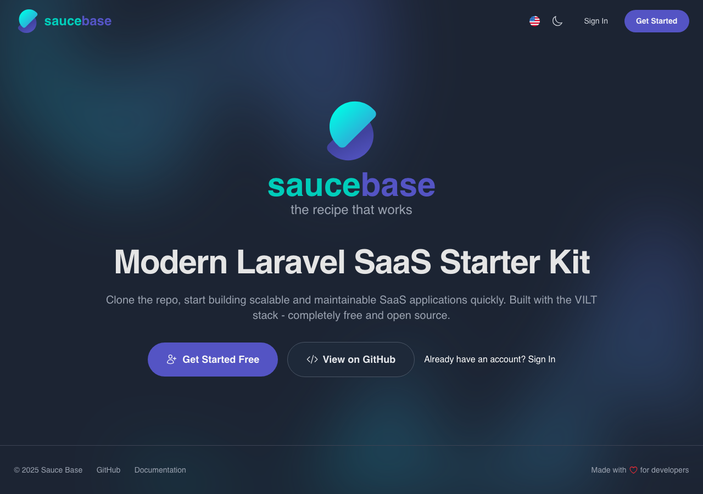
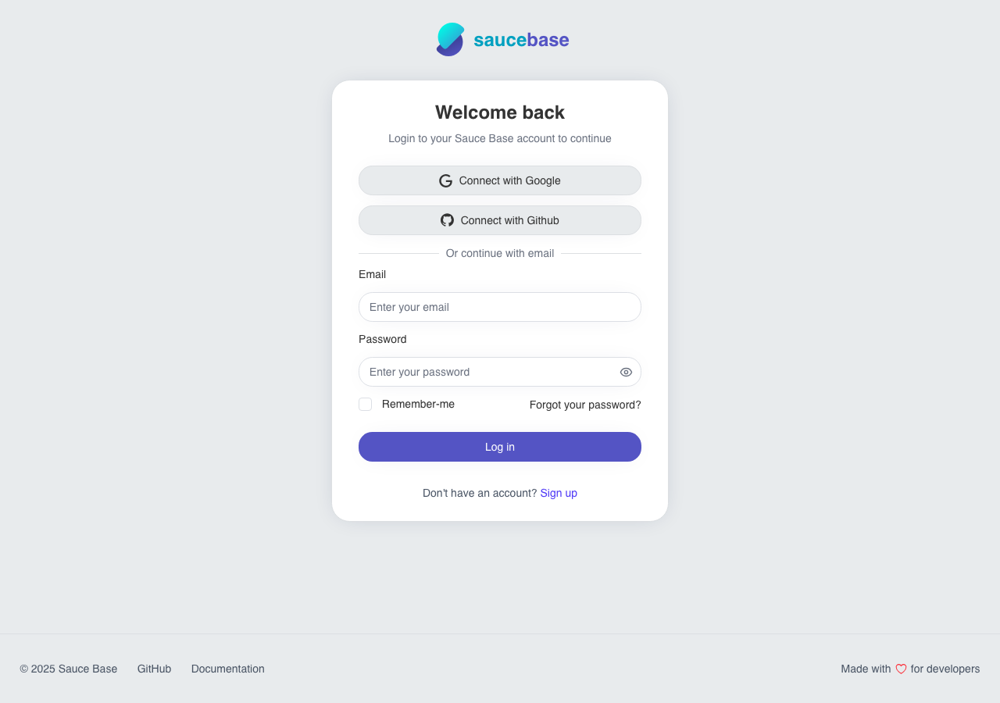
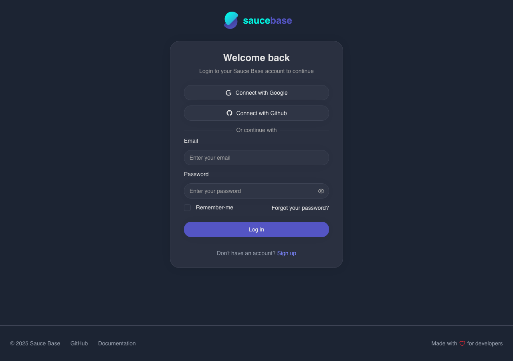
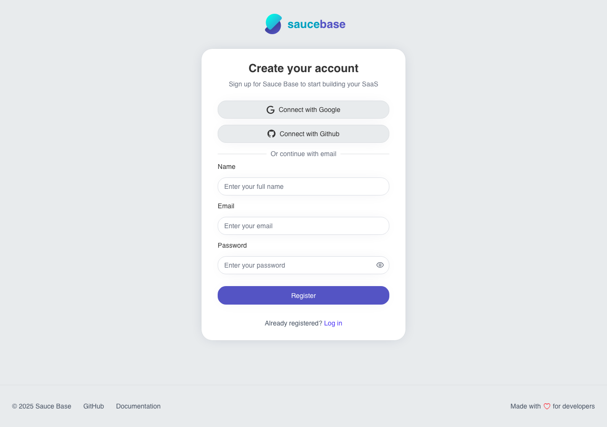
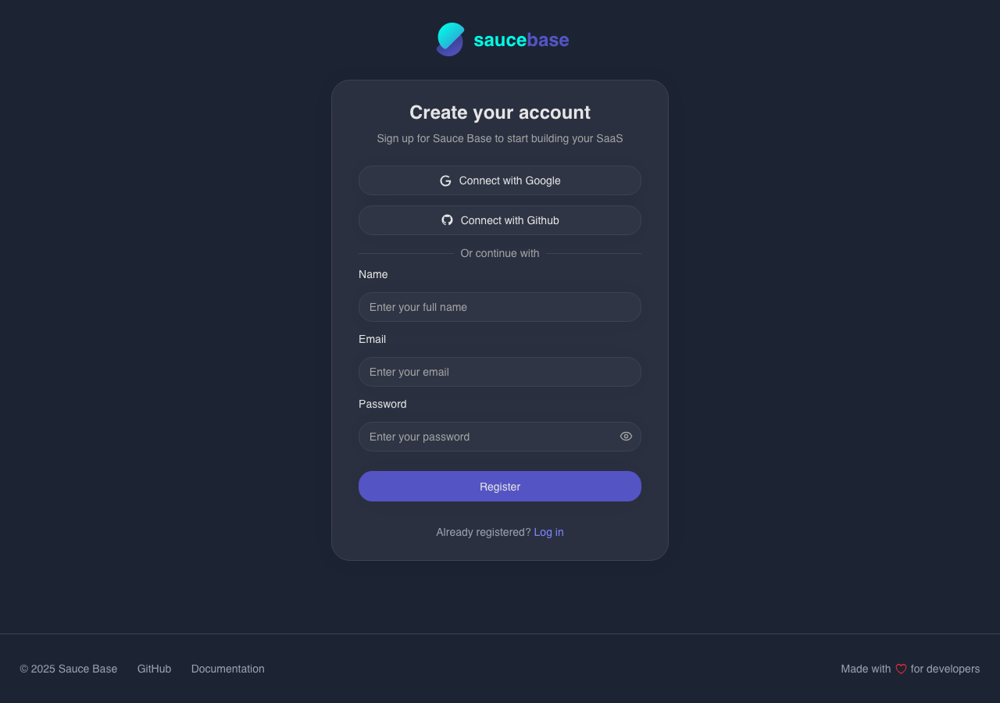
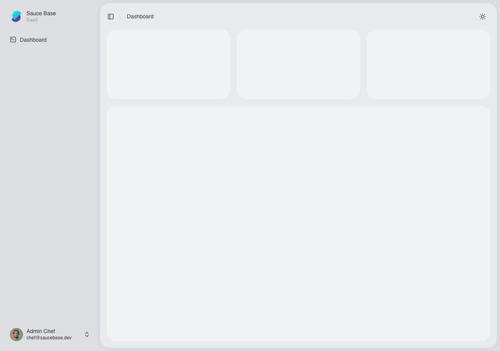
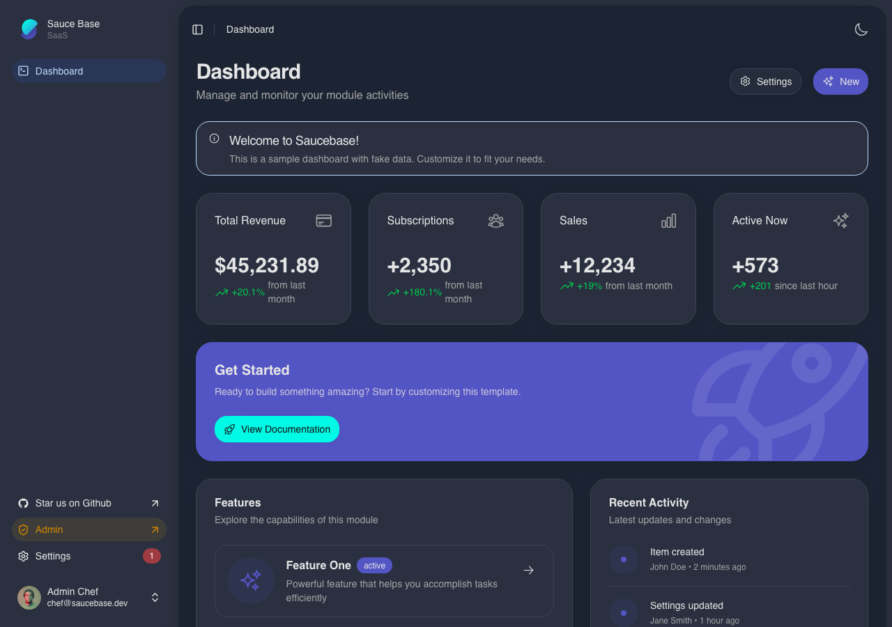
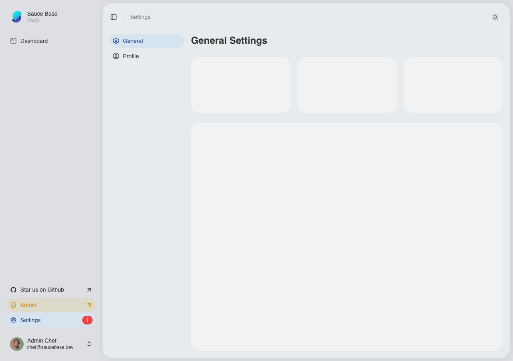
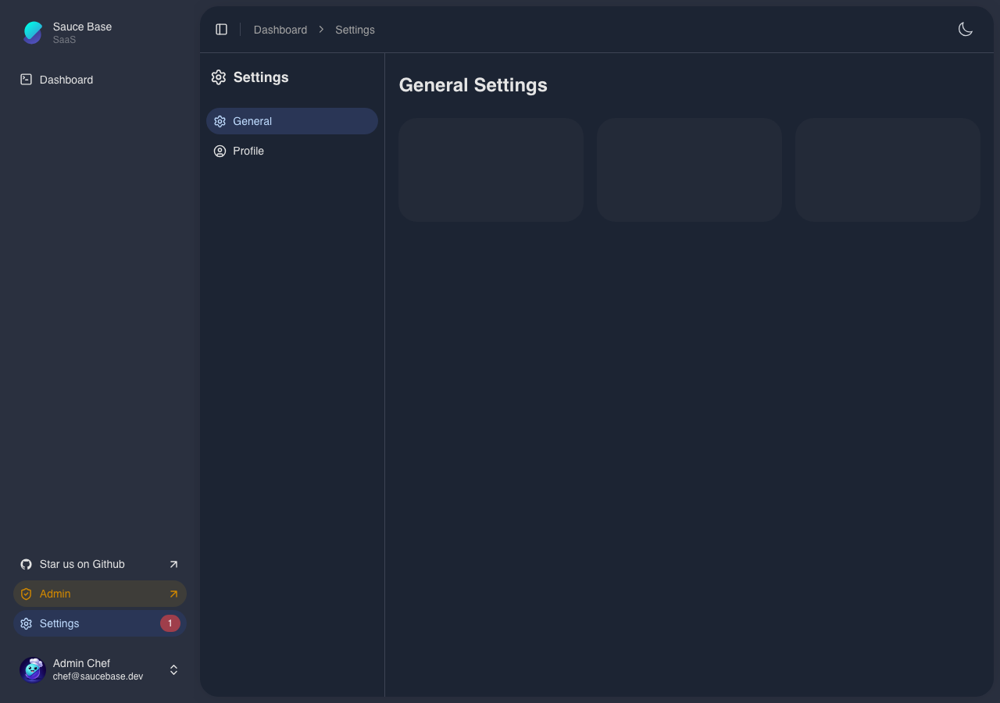

<p align="center">
  
</p>

# Saucebase

**Modular Laravel SaaS Starter Kit**

> ⚠️ **Active development** – APIs, features, and architecture may change without notice.

[](https://github.com/sauce-base/core/actions/workflows/ci.yml)
[](LICENSE)
[](https://php.net)
[](https://laravel.com)
[](https://vuejs.org)
[](https://typescriptlang.org)
[](https://vitejs.dev)
[](https://tailwindcss.com)
[](https://nodejs.org)
[](https://inertiajs.com)
[](https://filamentphp.com)
[](https://playwright.dev)
[](https://phpstan.org)
[](https://commitlint.js.org)

Sauce Base is a batteries-included Laravel starter kit built around the **VILT stack** (Vue, Inertia, Laravel, Tailwind). It embraces a modular architecture so you can
**install, copy, and own** feature packs—just like shadcn/ui—without inheriting hidden dependencies. Start from a solid core, pick the modules you need, and ship your SaaS
faster.

---

## 🚀 Why Sauce Base?

- **Modern Foundations**: Laravel 12, PHP 8.4+, Vue 3, TypeScript, Tailwind CSS 4, Vite 6.
- **First-Class Modules**: Installable feature modules (Auth, Localization, …) that you can copy, customize, and own forever.
- **Full-Stack DX**: Inertia.js SPA experience, Pinia stores, Ziggy routes, persistent state, i18n, built-in dark/light mode and theme management.
- **Headless Admin**: Filament 4 panel already wired.

---

## 📸 Screenshots

### Home Page

**Light Theme**


**Dark Theme**



### Authentication

**Login Page - Light Theme**



**Login Page - Dark Theme**



**Register Page - Light Theme**



**Register Page - Dark Theme**



### Dashboard

**Light Theme**



**Dark Theme**



### Settings

**Light Theme**



**Dark Theme**



---

### Prerequisites

- Docker
- Node.js 22+ and npm

## 🧱 Architecture Overview

```
├── app/                  # Core Laravel application (service providers, models, listeners)
├── modules/              # Feature modules (Auth, Localization, …) – install, copy, own
│   └── <ModuleName>/
│       ├── app/          # Module controllers, actions, providers
│       ├── resources/    # Vue pages/components, CSS, translations
│       └── routes/       # Module routes (web + api)
├── resources/js/         # Inertia SPA (layouts, pages, Pinia stores, middleware, UI lib)
├── database/             # Migrations, factories, seeders (roles & demo users included)
├── docker/               # Development Dockerfiles + configs
└── module-loader.js      # Collects enabled module assets and settings automatically
```

- Modules are managed with **nwidart/laravel-modules** and automatically discovered if marked `true` in `modules_statuses.json`.
- The SPA loads module pages with the namespace syntax (e.g. `Auth::Login`) so copied modules stay self-contained.
- Tailwind is configured via the new V4 workflow with shadcn-compatible component structure (`resources/js/components/...`).

---

## 📦 Modules to be installed

| Module         | Highlights                                                                                                       |
| -------------- | ---------------------------------------------------------------------------------------------------------------- |
| **Roles**      | Role management with Spatie permissions integration. [View module →](https://github.com/sauce-base/roles)        |
| **Auth**       | Authentication module for Laravel with social login support. [View module →](https://github.com/sauce-base/auth) |
| **Dashboard**  | Dashboard basic structure [View module →](https://github.com/sauce-base/dashboard)                               |
| **Navigation** | Navigation module for managing menus and links [View module →](https://github.com/sauce-base/navigation)         |
| **Settings**   | Settings management module [View module →](https://github.com/sauce-base/settings)                               |

### Copy-and-Own Philosophy

Upcoming modules will follow the same copy-and-own philosophy—pull the files you need, keep them in your repo, iterate freely.

---

## ⚙️ Quick Start

1. **Clone & bootstrap**

    ```bash
    git clone https://github.com/sauce-base/core.git
    cd core
    chmod +x bin/setup-env
    ./bin/setup-env
    ```

    The script checks prerequisites, prepares SSL certs (if mkcert is present), spins up Docker, runs migrations/seeds, installs JS/PHP deps.

2. **Visit the app**
    - Site: https://localhost (self-signed cert) or http://localhost
    - Filament Admin: https://localhost/admin

3. **Add Auth Module**§

Install the Auth module for authentication features:\*\*\*

`composer require saucebase/auth`

Run composer dump-autoload:

`composer dump-autoload`

Enable the module:

`docker compose exec workspace php artisan module:enable Auth`

Run migrations for the module:

`docker compose exec workspace php artisan module:migrate Auth`

Build the frontend assets:

`npm run build`

Check out the [Auth Module README](https://github.com/sauce-base/auth) for configuration details.

Complete documentation coming soon!

## 📄 License

MIT © Sauce Base. See [LICENSE](LICENSE).

---
